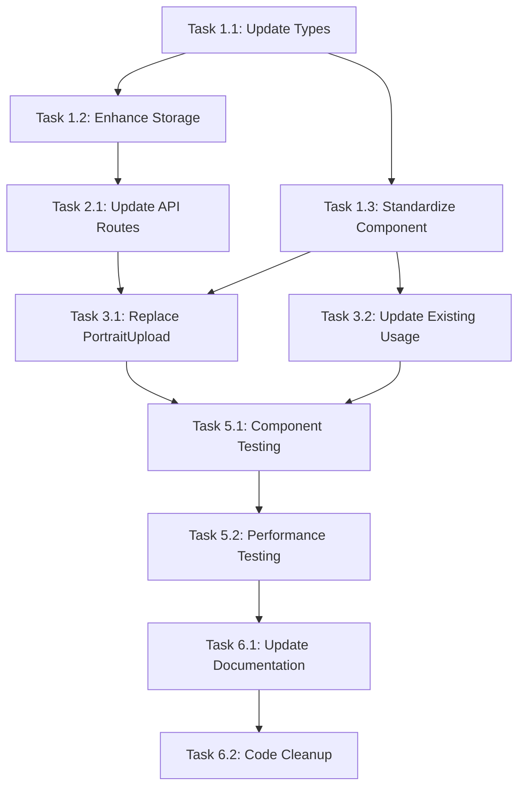

# Avatar System Harmonization Tasks

## Task Overview
Đồng bộ hóa hệ thống avatar management với codebase hiện tại để đảm bảo tính nhất quán và tái sử dụng code.

## Task List

### Phase 1: Core System Harmonization

#### Task 1.1: Update Type Definitions
**Priority:** High  
**Estimated Time:** 2 hours  
**Status:** ⏳ Pending

**Description:**
Cập nhật type definitions để đảm bảo consistency với existing codebase.

**Acceptance Criteria:**
- [ ] Review và align avatar types với existing `lib/types.ts`
- [ ] Ensure `portrait_url` field usage is consistent
- [ ] Add proper TypeScript interfaces for avatar operations
- [ ] Maintain backward compatibility với existing types

**Files to modify:**
- `lib/types.ts`
- `lib/services/avatar-storage.ts`
- `components/avatar/avatar-manager.tsx`

---

#### Task 1.2: Enhance Avatar Storage Service
**Priority:** High  
**Estimated Time:** 3 hours  
**Status:** ⏳ Pending

**Description:**
Cập nhật avatar storage service để follow existing Supabase patterns và error handling.

**Acceptance Criteria:**
- [ ] Use existing `createClient()` patterns from `lib/supabase/client.ts`
- [ ] Implement consistent error handling với existing services
- [ ] Add proper retry logic following existing patterns
- [ ] Ensure storage bucket configuration is consistent

**Files to modify:**
- `lib/services/avatar-storage.ts`
- `lib/supabase/client.ts` (if needed)

---

#### Task 1.3: Standardize AvatarManager Component
**Priority:** High  
**Estimated Time:** 4 hours  
**Status:** ⏳ Pending

**Description:**
Cập nhật AvatarManager component để consistent với existing component patterns.

**Acceptance Criteria:**
- [ ] Follow shadcn/ui component patterns
- [ ] Use consistent `cn()` utility for styling
- [ ] Implement proper error handling với `toast` from sonner
- [ ] Ensure responsive behavior is consistent
- [ ] Add proper accessibility attributes

**Files to modify:**
- `components/avatar/avatar-manager.tsx`
- `components/avatar/avatar-display.tsx`
- `lib/utils/accessibility.ts`

---

### Phase 2: API Harmonization

#### Task 2.1: Update Avatar API Routes
**Priority:** High  
**Estimated Time:** 3 hours  
**Status:** ⏳ Pending

**Description:**
Cập nhật avatar API routes để follow existing API patterns và middleware.

**Acceptance Criteria:**
- [ ] Follow existing API route structure patterns
- [ ] Use consistent error response format
- [ ] Implement proper authentication middleware
- [ ] Add rate limiting alignment với existing endpoints
- [ ] Ensure proper request validation

**Files to modify:**
- `app/api/registrants/[id]/avatar/route.ts`
- Add middleware if needed

---

#### Task 2.2: Database Integration Alignment
**Priority:** Medium  
**Estimated Time:** 2 hours  
**Status:** ⏳ Pending

**Description:**
Đảm bảo avatar system sử dụng đúng database fields và patterns.

**Acceptance Criteria:**
- [ ] Use existing `portrait_url` field from `Registrant` interface
- [ ] Ensure proper database updates through existing patterns
- [ ] Maintain referential integrity
- [ ] Test với existing data

**Files to modify:**
- Database queries in avatar API routes
- Avatar storage service database operations

---

### Phase 3: Component Replacement

#### Task 3.1: Replace PortraitUpload Component
**Priority:** High  
**Estimated Time:** 4 hours  
**Status:** ⏳ Pending

**Description:**
Thay thế `PortraitUpload` component bằng `AvatarManager` trong ticket workflow.

**Acceptance Criteria:**
- [ ] Replace `PortraitUpload` usage với `AvatarManager`
- [ ] Maintain existing functionality trong ticket generation
- [ ] Preserve existing upload validation rules
- [ ] Ensure backward compatibility với existing portraits
- [ ] Update any related components or workflows

**Files to modify:**
- `components/tickets/portrait-upload.tsx` (remove or deprecate)
- Any components using `PortraitUpload`
- Ticket generation workflow files

---

#### Task 3.2: Update Existing Avatar Usage
**Priority:** Medium  
**Estimated Time:** 3 hours  
**Status:** ⏳ Pending

**Description:**
Standardize existing `AvatarManager` usage across components.

**Acceptance Criteria:**
- [ ] Review all existing `AvatarManager` usage
- [ ] Standardize props và behavior
- [ ] Ensure consistent error handling
- [ ] Update any inconsistent implementations

**Files to modify:**
- `components/dashboard/registration-card.tsx`
- `components/admin/registrations-list.tsx`
- Any other components using avatars

---

### Phase 4: Performance & Optimization

#### Task 4.1: Image Compression Integration
**Priority:** Medium  
**Estimated Time:** 2 hours  
**Status:** ⏳ Pending

**Description:**
Đảm bảo avatar system sử dụng existing image compression utilities properly.

**Acceptance Criteria:**
- [ ] Use existing `compressAvatarImage` function
- [ ] Ensure compression settings are optimal
- [ ] Test compression performance
- [ ] Validate compression quality

**Files to modify:**
- `lib/image-compression.ts`
- Avatar upload workflows

---

#### Task 4.2: Responsive Utilities Integration
**Priority:** Medium  
**Estimated Time:** 2 hours  
**Status:** ⏳ Pending

**Description:**
Đảm bảo responsive utilities work properly với existing breakpoint system.

**Acceptance Criteria:**
- [ ] Test responsive behavior across devices
- [ ] Ensure breakpoint consistency
- [ ] Validate touch device detection
- [ ] Test mobile/desktop workflows

**Files to modify:**
- `lib/utils/responsive.ts`
- Avatar components using responsive utilities

---

### Phase 5: Testing & Validation

#### Task 5.1: Component Testing
**Priority:** High  
**Estimated Time:** 4 hours  
**Status:** ⏳ Pending

**Description:**
Tạo comprehensive tests cho harmonized avatar system.

**Acceptance Criteria:**
- [ ] Unit tests cho all avatar components
- [ ] Integration tests cho avatar workflows
- [ ] API endpoint testing
- [ ] Error handling testing
- [ ] Accessibility testing

**Files to create/modify:**
- `__tests__/avatar/avatar-manager.test.tsx`
- `__tests__/services/avatar-storage.test.ts`
- API route tests

---

#### Task 5.2: Performance Testing
**Priority:** Medium  
**Estimated Time:** 3 hours  
**Status:** ⏳ Pending

**Description:**
Test performance của harmonized system và optimize if needed.

**Acceptance Criteria:**
- [ ] Measure avatar loading performance
- [ ] Test compression efficiency
- [ ] Validate bundle size impact
- [ ] Test với large avatar lists
- [ ] Mobile performance testing

**Files to modify:**
- Performance test files
- Optimization improvements if needed

---

### Phase 6: Documentation & Cleanup

#### Task 6.1: Update Documentation
**Priority:** Low  
**Estimated Time:** 2 hours  
**Status:** ⏳ Pending

**Description:**
Cập nhật documentation để reflect harmonized system.

**Acceptance Criteria:**
- [ ] Update component documentation
- [ ] Update API documentation
- [ ] Create migration guide
- [ ] Update README if needed

**Files to create/modify:**
- Component documentation
- API documentation
- Migration guides

---

#### Task 6.2: Code Cleanup
**Priority:** Low  
**Estimated Time:** 2 hours  
**Status:** ⏳ Pending

**Description:**
Clean up deprecated code và ensure consistency.

**Acceptance Criteria:**
- [ ] Remove deprecated `PortraitUpload` component
- [ ] Clean up unused imports
- [ ] Remove duplicate code
- [ ] Ensure consistent code style

**Files to modify:**
- Remove deprecated files
- Clean up imports across components

---

## Task Dependencies

## Risk Assessment

### High Risk Tasks
- **Task 3.1 (Replace PortraitUpload)**: Could break existing ticket generation
- **Task 2.1 (Update API Routes)**: Could affect existing integrations

### Medium Risk Tasks
- **Task 1.3 (Standardize Component)**: Could affect existing avatar displays
- **Task 3.2 (Update Existing Usage)**: Could introduce UI inconsistencies

### Low Risk Tasks
- **Task 1.1 (Update Types)**: Mostly additive changes
- **Task 6.x (Documentation & Cleanup)**: No functional impact

## Success Criteria

### Technical Success
- [ ] All existing avatar functionality preserved
- [ ] No breaking changes to existing APIs
- [ ] Performance maintained or improved
- [ ] Code duplication reduced by >50%

### Quality Success
- [ ] All tests passing
- [ ] No accessibility regressions
- [ ] Consistent UI/UX across components
- [ ] Proper error handling throughout

### Business Success
- [ ] No user-facing disruptions
- [ ] Improved developer experience
- [ ] Easier maintenance và extension
- [ ] Better code organization

## Timeline

**Total Estimated Time:** 31 hours  
**Recommended Timeline:** 2-3 weeks  

**Week 1:** Phase 1-2 (Core harmonization)  
**Week 2:** Phase 3-4 (Component replacement & optimization)  
**Week 3:** Phase 5-6 (Testing & cleanup)

## Notes

- Prioritize backward compatibility throughout all tasks
- Test thoroughly before deploying to production
- Consider feature flags for gradual rollout
- Monitor performance metrics after deployment
- Keep rollback plan ready for each phase