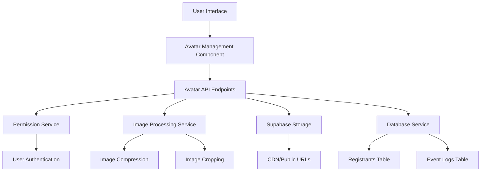
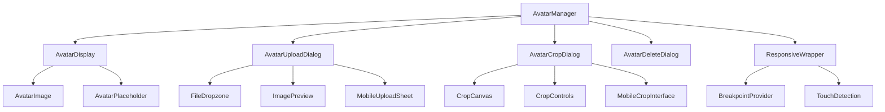

# Design Document

## Overview

Hệ thống quản lý avatar cho registrants sẽ mở rộng chức năng hiện có của `PortraitUpload` component để cung cấp một giải pháp toàn diện cho việc upload, crop, edit và delete avatar. Hệ thống sẽ tích hợp với Supabase Storage bucket 'portraits' hiện có và sử dụng field `portrait_url` trong bảng `registrants`.

## Architecture

### High-Level Architecture



### Component Architecture



## Components and Interfaces

### 1. Responsive Design Strategy

#### Mobile-First Approach
- Thiết kế ưu tiên mobile với breakpoints:
  - Mobile: < 768px
  - Tablet: 768px - 1024px  
  - Desktop: > 1024px

#### Touch-Friendly Interface
- Minimum touch target: 44x44px
- Adequate spacing between interactive elements
- Swipe gestures cho navigation
- Haptic feedback cho mobile actions

#### Progressive Enhancement
- Core functionality hoạt động trên tất cả devices
- Enhanced features cho desktop (hover states, keyboard shortcuts)
- Graceful degradation cho older browsers

### 2. Core Components

#### AvatarManager Component
```typescript
interface AvatarManagerProps {
  registrantId: string;
  currentAvatarUrl?: string;
  size?: 'sm' | 'md' | 'lg';
  editable?: boolean;
  onAvatarChange?: (newUrl: string | null) => void;
}
```

Chức năng chính:
- Hiển thị avatar hiện tại hoặc placeholder
- Cung cấp controls để upload/edit/delete (nếu editable=true)
- Quản lý state của các dialogs

#### AvatarDisplay Component
```typescript
interface AvatarDisplayProps {
  src?: string;
  alt: string;
  size: 'sm' | 'md' | 'lg';
  fallbackInitials: string;
  className?: string;
  responsive?: boolean; // Auto-adjust size based on screen
}
```

Kích thước responsive:
- `sm`: 32x32px (mobile) / 40x40px (desktop) - danh sách
- `md`: 64x64px (mobile) / 80x80px (desktop) - detail view  
- `lg`: 96x96px (mobile) / 120x120px (desktop) - profile/edit

#### AvatarUploadDialog Component
```typescript
interface AvatarUploadDialogProps {
  open: boolean;
  onOpenChange: (open: boolean) => void;
  registrantId: string;
  onUploadComplete: (url: string) => void;
}
```

#### AvatarCropDialog Component
```typescript
interface AvatarCropDialogProps {
  open: boolean;
  onOpenChange: (open: boolean) => void;
  imageFile: File;
  onCropComplete: (croppedFile: File) => void;
  isMobile?: boolean; // Auto-detect or manual override
}
```

**Mobile-specific features:**
- Touch-friendly crop controls
- Pinch-to-zoom gesture support
- Larger touch targets (minimum 44px)
- Simplified UI with essential controls only
- Full-screen crop interface on mobile

### 2. API Endpoints

#### POST /api/registrants/[id]/avatar
- Upload và crop avatar mới
- Input: FormData với image file và crop parameters
- Output: { success: boolean, avatarUrl: string }

#### PUT /api/registrants/[id]/avatar
- Cập nhật avatar hiện tại
- Input: FormData với image file và crop parameters
- Output: { success: boolean, avatarUrl: string }

#### DELETE /api/registrants/[id]/avatar
- Xóa avatar hiện tại
- Output: { success: boolean }

#### GET /api/registrants/[id]/avatar
- Lấy thông tin avatar hiện tại
- Output: { avatarUrl: string | null, lastModified: string }

### 3. Services

#### PermissionService
```typescript
interface PermissionService {
  canManageAvatar(userId: string, registrantId: string): Promise<boolean>;
  isAdmin(userRole: UserRole): boolean;
  getRegistrantOwner(registrantId: string): Promise<string>;
}
```

#### ImageProcessingService
```typescript
interface ImageProcessingService {
  compressImage(file: File, options: CompressionOptions): Promise<File>;
  cropAndCompressAvatar(file: File, cropData: CropData): Promise<File>;
}

interface CropData {
  x: number;
  y: number;
  width: number;
  height: number;
  scale: number;
}

// Avatar-specific compression options
const AVATAR_COMPRESSION: CompressionOptions = {
  maxWidth: 512,
  maxHeight: 512,
  quality: 0.85,
  maxSizeKB: 200,
};
```

**Quy trình nén ảnh avatar:**
1. Crop ảnh theo vùng được chọn (1:1 ratio)
2. Resize về kích thước 512x512px
3. Nén với quality 0.85
4. Đảm bảo file size < 200KB
5. Convert sang JPEG format

#### StorageService
```typescript
interface StorageService {
  uploadAvatar(userId: string, registrantId: string, file: File): Promise<string>;
  deleteAvatar(userId: string, registrantId: string): Promise<void>;
  getAvatarUrl(userId: string, registrantId: string): string;
}
```

## Data Models

### Database Schema Updates
Không cần thay đổi schema vì đã có field `portrait_url` trong bảng `registrants`.

### Storage Structure
```
portraits/
├── {user_id}/
│   └── {registrant_id}-portrait.jpg
```

Mỗi registrant chỉ có một file avatar duy nhất. Khi upload avatar mới, file cũ sẽ được ghi đè (upsert: true).

### Event Logging
```typescript
interface AvatarEventLog {
  event_type: 'avatar_uploaded' | 'avatar_updated' | 'avatar_deleted';
  user_id: string;
  registrant_id: string;
  metadata: {
    file_size?: number;
    file_type?: string;
    admin_action?: boolean;
  };
}
```

## Error Handling

### Client-Side Error Handling
1. **Lỗi Xác Thực File**
   - Định dạng file không hợp lệ → "Vui lòng chọn file ảnh (JPG, PNG, WEBP)"
   - File quá lớn → "File quá lớn. Vui lòng chọn file dưới 5MB"
   - File bị hỏng → "File ảnh không hợp lệ"

2. **Lỗi Mạng**
   - Timeout upload → "Quá thời gian upload. Vui lòng thử lại"
   - Lỗi kết nối → "Lỗi kết nối. Kiểm tra internet và thử lại"

3. **Lỗi Phân Quyền**
   - Chưa đăng nhập → "Bạn cần đăng nhập để thực hiện thao tác này"
   - Không có quyền → "Bạn không có quyền chỉnh sửa avatar này"

### Server-Side Error Handling
1. **Authentication Errors**
   - No auth token → 401 Unauthorized
   - Invalid token → 401 Unauthorized

2. **Authorization Errors**
   - User không sở hữu registrant → 403 Forbidden
   - Non-admin trying to access other's registrant → 403 Forbidden

3. **Validation Errors**
   - Invalid registrant ID → 400 Bad Request
   - Invalid file format → 400 Bad Request
   - File too large → 413 Payload Too Large

4. **Storage Errors**
   - Upload failed → 500 Internal Server Error
   - Delete failed → 500 Internal Server Error

## Mobile & Desktop UX Design

### Mobile Experience (< 768px)

#### Avatar Display
- **Danh sách registrants**: Avatar 32x32px với tên bên cạnh
- **Detail view**: Avatar 64x64px centered với edit button overlay
- **Touch interactions**: Tap để mở menu, long press cho quick actions

#### Upload Flow
1. **Trigger**: Tap vào avatar placeholder hoặc edit button
2. **Action Sheet**: Bottom sheet với options "Chụp ảnh", "Chọn từ thư viện", "Xóa avatar"
3. **File Selection**: Native mobile file picker hoặc camera
4. **Crop Interface**: Full-screen crop với touch controls
5. **Confirmation**: Preview với "Lưu" và "Hủy" buttons

#### Crop Interface Mobile
```typescript
interface MobileCropInterface {
  // Full-screen overlay
  fullScreen: true;
  // Touch gestures
  gestures: {
    pinchToZoom: boolean;
    dragToPan: boolean;
    doubleTapToFit: boolean;
  };
  // Simplified controls
  controls: {
    zoomSlider: boolean;
    resetButton: boolean;
    rotateButton: boolean;
  };
  // Bottom action bar
  actionBar: {
    cancelButton: string; // "Hủy"
    saveButton: string;   // "Lưu"
  };
}
```

### Desktop Experience (> 1024px)

#### Avatar Display
- **Danh sách registrants**: Avatar 40x40px với hover effects
- **Detail view**: Avatar 80x80px với hover overlay showing edit options
- **Mouse interactions**: Hover để hiện controls, click để edit

#### Upload Flow
1. **Trigger**: Click vào avatar hoặc hover overlay
2. **Modal Dialog**: Centered modal với drag-drop zone
3. **File Selection**: Drag-drop hoặc click để browse
4. **Crop Interface**: Modal với advanced controls
5. **Confirmation**: Preview trong modal với action buttons

#### Crop Interface Desktop
```typescript
interface DesktopCropInterface {
  // Modal dialog
  modal: true;
  // Mouse interactions
  interactions: {
    mouseWheelZoom: boolean;
    dragToPan: boolean;
    clickToCenter: boolean;
  };
  // Advanced controls
  controls: {
    zoomSlider: boolean;
    aspectRatioLock: boolean;
    gridOverlay: boolean;
    rotateButtons: boolean;
    flipButtons: boolean;
  };
  // Keyboard shortcuts
  shortcuts: {
    'Escape': 'cancel';
    'Enter': 'save';
    '+/-': 'zoom';
    'R': 'rotate';
  };
}
```

### Tablet Experience (768px - 1024px)

#### Hybrid Approach
- Kết hợp elements từ cả mobile và desktop
- Touch-friendly controls với advanced features
- Modal dialogs thay vì full-screen
- Larger touch targets nhưng compact layout

### Accessibility Features

#### Screen Reader Support
```typescript
interface AccessibilityProps {
  'aria-label': string;
  'aria-describedby': string;
  'role': 'img' | 'button';
  'tabIndex': number;
}
```

#### Keyboard Navigation
- Tab navigation qua tất cả interactive elements
- Enter/Space để activate buttons
- Escape để close dialogs
- Arrow keys để navigate crop area

#### High Contrast Support
- Respect system color preferences
- High contrast borders cho avatars
- Clear focus indicators
- Sufficient color contrast ratios

### Animation & Transitions

#### Mobile Animations
```css
/* Smooth transitions cho mobile */
.avatar-mobile {
  transition: transform 0.2s ease-out;
}

.avatar-mobile:active {
  transform: scale(0.95);
}

/* Bottom sheet animation */
.upload-sheet {
  transform: translateY(100%);
  transition: transform 0.3s cubic-bezier(0.4, 0, 0.2, 1);
}

.upload-sheet.open {
  transform: translateY(0);
}
```

#### Desktop Animations
```css
/* Hover effects cho desktop */
.avatar-desktop {
  transition: all 0.2s ease-in-out;
}

.avatar-desktop:hover {
  transform: scale(1.05);
  box-shadow: 0 4px 12px rgba(0, 0, 0, 0.15);
}

/* Modal animations */
.crop-modal {
  opacity: 0;
  transform: scale(0.95);
  transition: all 0.2s ease-out;
}

.crop-modal.open {
  opacity: 1;
  transform: scale(1);
}
```

### Performance Optimizations

#### Mobile Performance
- Lazy loading cho avatar lists
- Image compression trước khi upload
- Progressive image loading
- Reduced motion cho users với motion sensitivity

#### Desktop Performance
- Hover state preloading
- Keyboard shortcut handling
- Efficient re-rendering với React.memo
- Optimized bundle splitting

## Testing Strategy

### Unit Tests
1. **Component Tests**
   - AvatarManager rendering với/không avatar
   - AvatarDisplay với different sizes
   - Upload dialog functionality
   - Crop dialog functionality

2. **Service Tests**
   - PermissionService authorization logic
   - ImageProcessingService compression/cropping
   - StorageService upload/delete operations

3. **API Tests**
   - Endpoint authentication/authorization
   - File upload validation
   - Error response formats

### Integration Tests
1. **End-to-End Avatar Management**
   - Complete upload flow (mobile & desktop)
   - Edit existing avatar flow
   - Delete avatar flow
   - Permission enforcement

2. **Cross-Device Testing**
   - Mobile upload flow với touch gestures
   - Desktop upload flow với mouse interactions
   - Tablet hybrid experience
   - Responsive breakpoint transitions

3. **Cross-Component Integration**
   - Avatar display in different contexts
   - State synchronization after updates
   - Error propagation across devices

### Performance Tests
1. **Image Processing Performance**
   - Compression speed trên mobile vs desktop
   - Crop operation performance với touch vs mouse
   - Memory usage during processing trên different devices

2. **Mobile-Specific Performance**
   - Touch response time (< 100ms)
   - Gesture recognition accuracy
   - Battery usage during image processing
   - Network performance trên slow connections

3. **Storage Performance**
   - Upload speed for different file sizes
   - CDN cache effectiveness
   - Concurrent upload handling

## Security Considerations

### Authentication & Authorization
1. **Supabase Auth Integration**
   - Sử dụng `createClient()` từ `@/lib/supabase/client` và `@/lib/supabase/server`
   - Verify user session với `supabase.auth.getUser()`
   - Tích hợp với middleware hiện có trong `middleware.ts`

2. **Resource Access Control**
   - Sử dụng RLS (Row Level Security) policies hiện có
   - Users chỉ có thể quản lý registrants thuộc về registrations của họ
   - Admins (registration_manager, event_organizer, regional_admin, super_admin) có thể quản lý tất cả
   - Ghi log tất cả hành động admin vào bảng `event_logs`

### File Security
1. **File Validation**
   - Validate file type using magic numbers
   - Scan for malicious content
   - Limit file size (5MB max)

2. **Storage Security**
   - Use secure file naming convention
   - Implement proper CORS policies
   - Enable CDN security headers

### Data Privacy
1. **Personal Data Protection**
   - Secure avatar storage
   - Proper data deletion
   - Audit trail for admin actions

## Performance Optimization

### Image Optimization
1. **Compression Strategy**
   - Sử dụng `image-compression.ts` utility hiện có với cấu hình tùy chỉnh cho avatar:
     ```typescript
     const AVATAR_COMPRESSION: CompressionOptions = {
       maxWidth: 512,
       maxHeight: 512,
       quality: 0.85,
       maxSizeKB: 200, // 200KB max cho avatar
     };
     ```
   - Tự động resize về 512x512px (tỷ lệ 1:1)
   - Nén JPEG với quality 0.85 để cân bằng chất lượng và dung lượng
   - Hỗ trợ WebP cho trình duyệt hiện đại

2. **Lazy Loading**
   - Implement lazy loading for avatar lists
   - Use intersection observer
   - Placeholder during loading

### Caching Strategy
1. **Browser Caching**
   - Set appropriate cache headers
   - Use ETags for cache validation
   - Implement service worker caching

2. **CDN Optimization**
   - Leverage Supabase CDN
   - Enable image transformations
   - Set up proper cache policies

### Bundle Optimization
1. **Code Splitting**
   - Lazy load crop dialog component
   - Dynamic imports for heavy libraries
   - Tree shaking for unused code

## Deployment Considerations

### Environment Configuration
1. **Supabase Configuration**
   - Ensure 'portraits' bucket exists
   - Configure proper RLS policies
   - Set up CDN settings

2. **Next.js Configuration**
   - Configure image domains in next.config.js
   - Set up proper API routes
   - Enable image optimization

### Migration Strategy
1. **Existing Data**
   - No migration needed (field already exists)
   - Existing portraits will continue to work
   - Gradual rollout of new features

2. **Feature Flags**
   - Enable avatar management per user role
   - A/B test new UI components
   - Rollback capability

## Monitoring and Analytics

### Performance Monitoring
1. **Upload Metrics**
   - Upload success/failure rates
   - Average upload time
   - File size distribution

2. **User Engagement**
   - Avatar upload adoption rate
   - Feature usage by user role
   - Error frequency and types

### Logging Strategy
1. **Application Logs**
   - Avatar management actions
   - Error occurrences
   - Performance metrics

2. **Audit Logs**
   - Admin actions on user avatars
   - Permission violations
   - Data access patterns