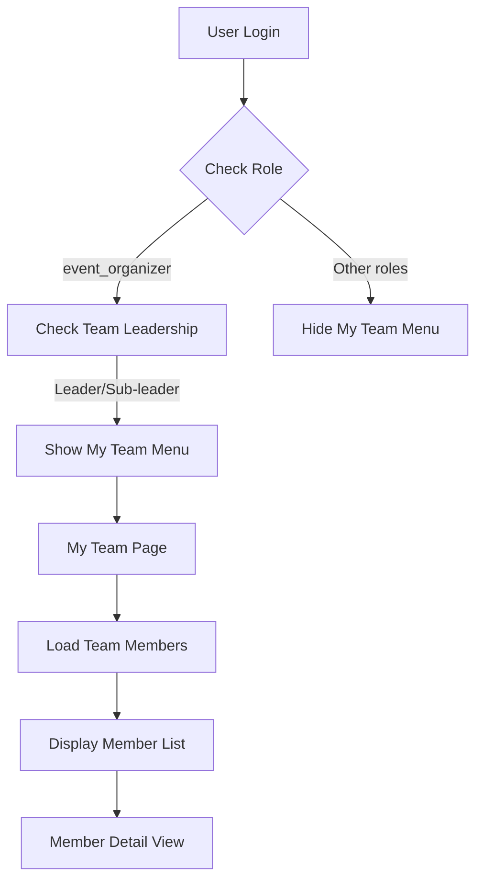

# Tài liệu Thiết kế - Quản lý Thành viên Nhóm

## Tổng quan

Tính năng Quản lý Thành viên Nhóm cho phép trưởng nhóm và thư ký (có role `event_organizer`) xem và quản lý thông tin thành viên trong nhóm của họ. Hệ thống sẽ tích hợp với cấu trúc `event_teams` và `registrants` hiện có, thêm menu "Nhóm của tôi" vào dashboard, và tạo giao diện quản lý nhóm chuyên dụng.

## Kiến trúc

### Cấu trúc Database hiện có
- `event_teams`: Chứa thông tin nhóm với `leader_id` và `sub_leader_id`
- `registrants`: Chứa thông tin người đăng ký với `event_team_id`
- `users`: Chứa thông tin user với `role`

### Luồng dữ liệu


### Kiến trúc Component
```
app/(protected)/my-team/
├── page.tsx                    # Main team management page
├── components/
│   ├── team-overview.tsx       # Team information overview
│   ├── member-list.tsx         # List of team members
│   ├── member-card.tsx         # Individual member card
│   └── member-detail-modal.tsx # Member detail popup
```

## Components và Interfaces

### 1. Dashboard Integration
**File:** `app/(protected)/dashboard/page.tsx`
- Thêm menu "Nhóm của tôi" cho users có role `event_organizer`
- Kiểm tra xem user có phải là leader hoặc sub-leader không

### 2. My Team Page
**File:** `app/(protected)/my-team/page.tsx`
- Route chính cho tính năng quản lý nhóm
- Kiểm tra quyền truy cập
- Load thông tin nhóm và thành viên

### 3. API Endpoints
**File:** `app/api/my-team/route.ts`
- GET: Lấy thông tin nhóm và danh sách thành viên
- Kiểm tra quyền truy cập dựa trên leader_id/sub_leader_id

### 4. Team Overview Component
**File:** `components/my-team/team-overview.tsx`
- Hiển thị thông tin tổng quan về nhóm
- Thống kê thành viên (tổng số, theo giới tính, độ tuổi)
- Thông tin liên lạc của trưởng nhóm và thư ký

### 5. Member List Component
**File:** `components/my-team/member-list.tsx`
- Danh sách thành viên dạng card hoặc table
- Tìm kiếm và lọc thành viên
- Sắp xếp theo tên, vai trò, trạng thái

### 6. Member Detail Modal
**File:** `components/my-team/member-detail-modal.tsx`
- Popup hiển thị thông tin chi tiết thành viên
- Thông tin đăng ký, liên lạc, trạng thái check-in

## Data Models

### Team Information Interface
```typescript
interface MyTeamInfo {
  id: string;
  name: string;
  description?: string;
  capacity?: number;
  member_count: number;
  leader?: {
    id: string;
    full_name: string;
    email: string;
  };
  sub_leader?: {
    id: string;
    full_name: string;
    email: string;
  };
  event_config: {
    name: string;
    is_active: boolean;
  };
}
```

### Team Member Interface
```typescript
interface TeamMember {
  id: string;
  full_name: string;
  saint_name?: string;
  email?: string;
  phone?: string;
  gender: GenderType;
  age_group: AgeGroupType;
  province?: string;
  diocese?: string;
  shirt_size: ShirtSizeType;
  event_role?: {
    name: string;
    description?: string;
  };
  is_checked_in?: boolean;
  checked_in_at?: string;
  registration_status: RegistrationStatus;
  created_at: string;
}
```

## Error Handling

### Authorization Errors
- **401 Unauthorized**: User chưa đăng nhập
- **403 Forbidden**: User không có role `event_organizer` hoặc không phải leader/sub-leader
- **404 Not Found**: User không được phân vào nhóm nào

### Data Errors
- **500 Internal Server Error**: Lỗi database hoặc server
- **Empty State**: Nhóm chưa có thành viên nào

### Error Messages (Tiếng Việt)
```typescript
const ERROR_MESSAGES = {
  UNAUTHORIZED: "Bạn cần đăng nhập để truy cập tính năng này",
  FORBIDDEN: "Bạn không có quyền truy cập tính năng này",
  NOT_TEAM_LEADER: "Bạn không phải là trưởng nhóm hoặc thư ký",
  NO_TEAM_ASSIGNED: "Bạn chưa được phân vào nhóm nào",
  TEAM_NOT_FOUND: "Không tìm thấy thông tin nhóm",
  MEMBERS_LOAD_ERROR: "Không thể tải danh sách thành viên",
  NETWORK_ERROR: "Lỗi kết nối, vui lòng thử lại"
};
```

## Testing Strategy

### Unit Tests
- Test API endpoints với các role khác nhau
- Test component rendering với dữ liệu mock
- Test authorization logic

### Integration Tests
- Test luồng từ dashboard đến my-team page
- Test tương tác giữa các components
- Test error handling

### E2E Tests
- Test complete user journey từ login đến xem thông tin nhóm
- Test responsive design trên mobile/desktop
- Test accessibility compliance

## Security Considerations

### Authorization
- Kiểm tra role `event_organizer` ở cả client và server
- Verify user là leader hoặc sub-leader của nhóm
- Chỉ hiển thị thông tin thành viên trong nhóm được phân công

### Data Privacy
- Chỉ hiển thị thông tin cần thiết cho quản lý nhóm
- Không hiển thị thông tin nhạy cảm (password, payment info)
- Log truy cập để audit

### Input Validation
- Validate team ID và user ID
- Sanitize search queries
- Rate limiting cho API calls

## Performance Optimization

### Database Queries
- Sử dụng JOIN để giảm số lượng queries
- Index trên `event_team_id`, `leader_id`, `sub_leader_id`
- Pagination cho danh sách thành viên lớn

### Caching Strategy
- Cache thông tin nhóm trong session
- Client-side caching cho member list
- Invalidate cache khi có thay đổi

### Loading States
- Skeleton loading cho member list
- Progressive loading cho member details
- Error boundaries cho graceful degradation

## Mobile Responsiveness

### Breakpoints
- Mobile: < 768px - Stack layout, simplified cards
- Tablet: 768px - 1024px - Grid layout với 2 columns
- Desktop: > 1024px - Full grid layout với sidebar

### Touch Interactions
- Swipe gestures cho member cards
- Touch-friendly button sizes (min 44px)
- Pull-to-refresh cho member list

### Performance on Mobile
- Lazy loading cho images
- Minimize bundle size
- Optimize for slow networks